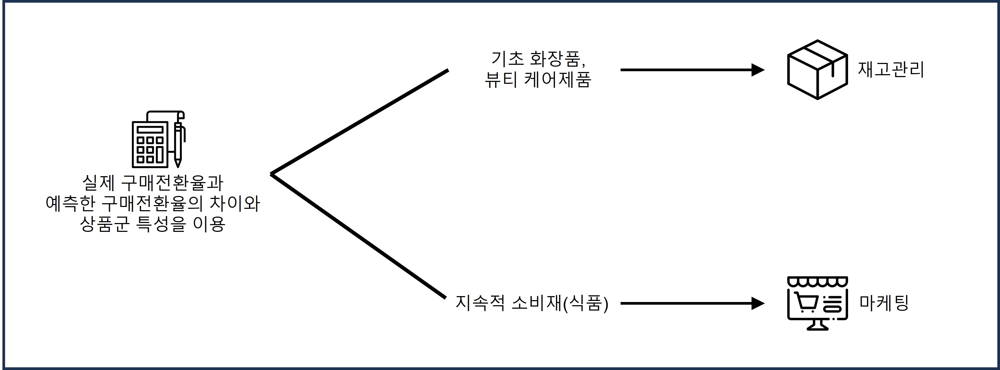

# WEATHER BIGDATA CONTEST

## 2021 날씨 빅데이터 콘테스트의 민간협력형에 참여   

## 주제
- 다양한 분야에서 날씨를 이용한 마케팅을 지속적으로 선보이고 성과 또한 좋게 나타나는 것을 확인해 이를 이용해 `날씨로 판매량을 예측`해보고자 함
- 이커머스의 급격한 성장을 활용해 온라인 소비방식을 보다 더 활성화하는 노력필요를 느낌
- 따라서 `상품별로 특성에 맞는 서비스`를 제안해보고자 함

## 목표
실제 구매전환율과 기상데이터를 이용해 예측한 구매전활율의 `차이를 통해 상품군 분류`

## 이용 데이터
- 기상청에서 제공하는 7게와 열린서울데이터광장의 미세먼지 데이터를 이용
- SNS이용율과 인터넷 쇼핑이용률이 높은 `여성 20대와 30대`의 데이터를 이용

> 분석대상 제품: 구매의 변동이 크게 나타나는 제품들을 이용   
> 소비가 심리적 변화에 영향을 받는 것으로 추측해 `변동이 큰 상위 30개의 제품` 이용

## 분석
유의확률을 이용한 생품군별 다중 선형 회귀 분석을 실시
구매전환율을 계산하여 실제의 구매전횐율과 비교실시

## 결론
   